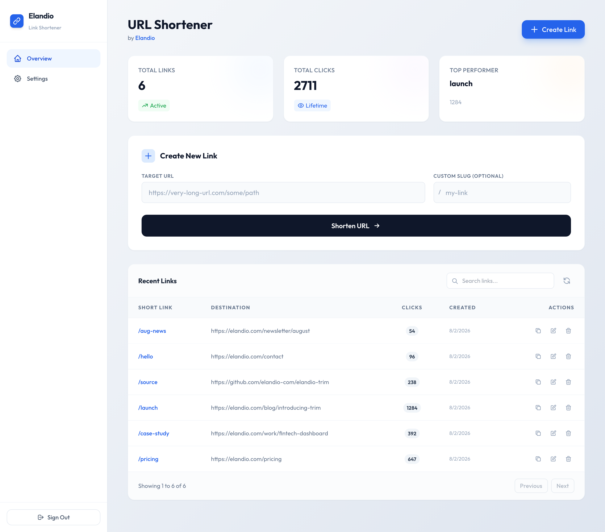
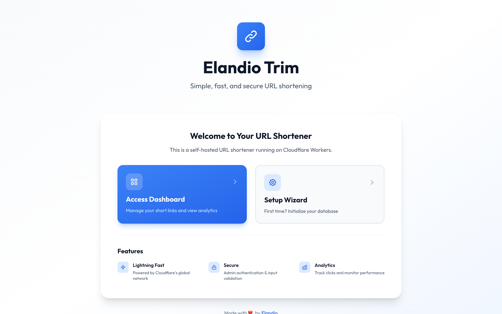

# Elandio Trim - URL Shortener

A simple, self-hostable URL shortener built on **Cloudflare Workers**, **D1 Database**, and **Vanilla JS**. Designed for dedicated domains (e.g., `link.yourdomain.com`).

<p align="center">
  
</p>

<p align="center">
  <em>Create, track and manage short links from a single page. No build step, no dependencies.</em>
</p>

---

## ✨ Features

- 🎨 **Clean dashboard** — create, edit, search and delete links
- ⚙️ **Configured from the UI** — no code editing to change settings
- 📊 **Click tracking** — per-link counts and totals
- 🌐 **Custom domains** — run it on `link.yourdomain.com`
- 🔒 **Locked down by default** — strict CSP, security headers on every response, validated redirect targets
- 🪶 **No build step** — vanilla JS, vendored CSS, self-hosted fonts
- 💰 **Free-tier friendly** — comfortably within Cloudflare's free limits for typical use

---

## 🚀 Deploy

Deployment takes about 10 minutes and **does require the terminal once**, to
create the D1 database and paste its id into `wrangler.toml`. Cloudflare cannot
provision the database for you from the deploy button alone.

```bash
git clone https://github.com/elandio-com/elandio-trim.git
cd elandio-trim
npm install

# 1. Create the database, then paste the printed id into wrangler.toml
npx wrangler d1 create elandio-trim-db

# 2. Set your admin token as an encrypted secret
openssl rand -base64 32          # copy the output
npx wrangler secret put ADMIN_TOKEN

# 3. Deploy
npx wrangler deploy
```

Then open `https://<your-worker>.workers.dev/setup.html` once to initialise the
tables, and log in at `/dashboard.html`.

Full walkthrough, including custom domains: **[DEPLOYMENT.md](./DEPLOYMENT.md)**.

> **Never put `ADMIN_TOKEN` in `wrangler.toml`.** That file is committed to git
> and its values are visible in plain text. Use `wrangler secret put`, or the
> Cloudflare dashboard with **Encrypt** selected.

---

## 🎯 For Developers

### Local Development

```bash
git clone https://github.com/elandio-com/elandio-trim.git
cd elandio-trim
npm install

# Local admin token — .dev.vars is gitignored
printf 'ENVIRONMENT="development"\nADMIN_TOKEN="dev-token"\n' > .dev.vars

# Start the dev server (default port 8787)
npm run dev
```

Open `http://localhost:8787/setup.html` once to create the tables, then log in at
`http://localhost:8787/dashboard.html`.

In `development`, URL validation is relaxed to accept `http://` and localhost
targets. Production requires HTTPS and rejects private/loopback addresses.

Useful scripts:

```bash
npm run typecheck    # tsc --noEmit, strict mode
npm run schema:sql   # regenerate database/schema.sql from src/worker/schema.ts
```

---

## 📖 Usage

The landing page gives first-time visitors a way into the dashboard or the setup
wizard:

<p align="center">
  
</p>

### Creating links

1. Open `/dashboard.html` and log in with your `ADMIN_TOKEN`.
2. Enter the target URL (e.g. `https://example.com/a/very/long/path`).
3. Optionally enter a custom slug, or leave it blank to auto-generate one.
4. Click **Shorten**. The link is live immediately at `https://link.yourdomain.com/<slug>`.

Slugs may contain letters, numbers, hyphens and underscores, up to 50 characters.
A handful of names (`api`, `dashboard`, `setup`, `vendor`, `fonts`, …) are
reserved so links can never shadow the app's own pages.

### Overview tab

View every link with its click count, search and filter, edit a target URL, or
delete a link.

### Settings tab

**Fallback URL** — where visitors are sent when they hit a slug that doesn't
exist. Leave it empty to serve the built-in 404 page instead.

## 🔧 Configuration

| Variable | Required | Notes |
| --- | --- | --- |
| `ADMIN_TOKEN` | **Yes** | The admin credential. Set it as an **encrypted secret**, never in `wrangler.toml`. The worker refuses to serve without it. |
| `ENVIRONMENT` | No | `development` relaxes URL validation. Defaults to production behaviour. |
| `FALLBACK_URL` | No | Redirect target for unknown slugs. The dashboard setting takes precedence over this. |

Locally these go in `.dev.vars` (gitignored).

## 🧱 Architecture

- **Worker** handles API + redirects
- **D1** stores links and settings
- **Assets** serve static dashboard files

## 🔐 Security Model

Intended for **single-admin, self-hosted** use. A single static admin token — no
user accounts, no sessions, no cookies — deliberately chosen to keep a
self-hosted deployment to one moving part. It is **not** suitable for
multi-tenant use.

Read **[SECURITY.md](./SECURITY.md)** before deploying publicly. It documents the
threat model and the known limitations honestly, including the ones that are not
fixed.

## ⚖️ Rate Limits (Default)

| Surface | Limit |
| --- | --- |
| `/api/*` | 5 requests/second per IP |
| Slug lookups (redirects) | 20 requests/second per IP |
| `/api/setup` | 1 request/minute per IP |

Redirects are rate limited because each one performs a D1 **write** to count the
click, so an unthrottled loop could burn the free tier's write quota. Static
assets are not rate limited.

These limits are per worker isolate and therefore best-effort — for real
protection use **Cloudflare WAF rate limiting rules**. Adjust the defaults in
`src/worker/middleware/rateLimit.ts`.

## ⚡ API Endpoints

All `/api/admin/*` routes require `Authorization: Bearer <ADMIN_TOKEN>`
(or an `x-admin-token` header).

| Method | Path | Purpose |
| --- | --- | --- |
| `GET` | `/api/health` | Liveness + database state. Unauthenticated. |
| `POST` | `/api/setup` | Initialise tables. Requires auth once initialised. |
| `POST` | `/api/admin/login` | Validate a token (no session is created). |
| `POST` | `/api/admin/create` | Create a link. `{ url, slug? }` |
| `GET` | `/api/admin/list` | List all links. |
| `PUT` | `/api/admin/:slug` | Update a link's target. `{ url }` |
| `DELETE` | `/api/admin/:slug` | Delete a link. |
| `GET` | `/api/admin/settings` | Read settings. |
| `PUT` | `/api/admin/settings` | Update settings. |

`/api/health` reports `{"status":"ok","database":"ok"}` when the database is
reachable and initialised, and `503` with `"status":"setup_required"` when it is
not — which makes it a genuine check that setup succeeded.

---

## 🌐 Custom Domain Setup

1. Ensure your domain uses Cloudflare nameservers
2. Go to Cloudflare Dashboard → Workers & Pages
3. Click your worker → Triggers → Add Custom Domain
4. Enter subdomain (e.g., `short.yourdomain.com`)
5. Wait 1-2 minutes for DNS

Done! Your links now use your custom domain.

---

## 🔒 Security Best Practices

### For administrators

1. **Use a strong token.** Generate it, don't invent it — `/api/admin/login`
   validates submitted tokens, so a guessable one will eventually be guessed:
   ```bash
   openssl rand -base64 32
   ```
2. **Store it encrypted.** Use `wrangler secret put ADMIN_TOKEN`, or the
   Cloudflare dashboard with **Encrypt** selected. Never `wrangler.toml`.
3. **Add WAF rate limiting** if the deployment is public. The built-in limiter is
   per-isolate and cannot stop a distributed attacker on its own.
4. **Monitor and rotate.** Check Cloudflare logs, delete suspicious links, and
   rotate the token periodically.
5. **Back up D1**: `wrangler d1 export <db> --output backup.sql`.

### Built-in protections

✅ **Authentication** — admin token required, compared in constant time  
✅ **SQL injection** — every query uses bound parameters  
✅ **Strict CSP** — `script-src 'self'`, no inline scripts, no third-party origins  
✅ **Headers on every response** — HSTS, `X-Frame-Options`, `nosniff`, `Referrer-Policy`, COOP  
✅ **Input validation** — URL scheme and slug format validated from a single shared definition  
✅ **Reserved paths** — links can never shadow the app's own pages or assets  
✅ **Redirect validation** — blocks non-HTTPS, private/loopback literals, and control characters  
✅ **Rate limiting** — on the API *and* on redirects  

See [SECURITY.md](./SECURITY.md) for what is **not** covered.

---

## 🆘 Troubleshooting

### "Unauthorized" in dashboard
- Verify `ADMIN_TOKEN` is set in Cloudflare Dashboard
- Click "Deploy" after adding the variable
- Clear browser cache

### Database not initialized
- Check `GET /api/health` — `"database":"uninitialized"` confirms it
- Visit `/setup.html` to initialise
- Verify `database_id` in `wrangler.toml` is a real id, not the placeholder

### Links not redirecting
- Check `GET /api/health` returns `"database":"ok"`
- Confirm the slug exists in the dashboard
- Check Cloudflare logs for the worker

### Security headers missing
- Confirm `run_worker_first = true` is still set under `[assets]` in
  `wrangler.toml`. Without it Cloudflare serves static files directly, the worker
  never runs, and no headers are applied to HTML.

### Custom domain not working
- Wait 1-2 minutes for DNS propagation
- Verify domain uses Cloudflare nameservers
- Check domain shows "Active" in Cloudflare

## ✅ Manual QA (Quick Check)

- `dashboard.html` loads without console errors
- Login works with `ADMIN_TOKEN`
- Create / edit / delete links works
- Redirects work for existing slugs
- 404 fallback URL behaves as expected

---

## 💰 Cost

Cloudflare’s free tier is typically enough for personal and small business use. For current limits and pricing, refer to Cloudflare’s official pricing pages.

---

## 🛠️ Tech Stack

- **Frontend:** HTML, vanilla JavaScript, Tailwind CSS (vendored browser build, no build step)
- **Backend:** Cloudflare Workers (TypeScript, `strict` mode)
- **Database:** Cloudflare D1 (SQLite)
- **Deployment:** Wrangler CLI
- **Runtime dependencies:** none

Fonts (`Outfit`) and Tailwind are self-hosted under `src/pages/fonts/` and
`src/pages/vendor/`, so no third-party origin is contacted at runtime and the CSP
can stay locked to `'self'`. To update Tailwind:

```bash
curl -o src/pages/vendor/tailwind.js https://cdn.tailwindcss.com/3.4.16
```

---

## 🤝 Contributing

Contributions welcome! See [CONTRIBUTING.md](./CONTRIBUTING.md) for guidelines.

**Found a bug?** Open an issue.  
**Have an idea?** Start a discussion.  
**Want to help?** Submit a PR.

---

## 📄 License

**Apache License 2.0** — see [LICENSE](./LICENSE).

You are free to use, modify, self-host and run this commercially, for free,
whether you're an individual, a freelancer, or an agency running it for clients.
No permission needed and nothing to pay.

Two things the license asks in return:

- **Keep the attribution.** If you redistribute it, keep the `LICENSE` and
  `NOTICE` files and state what you changed.
- **Don't use the name.** The license covers the *code*, not the *brand*.
  "Elandio" and "Elandio Trim" are trademarks — fork it freely, but don't call
  your fork Elandio Trim or imply it's endorsed by us. (Section 6 of the License.)

> Releases up to and including v1.0.0 were published under the MIT License, and
> remain available under those terms. Later versions are Apache 2.0.

---

## 🙏 Acknowledgments

Built with ❤️ by [Elandio](https://elandio.com)

Powered by:
- [Cloudflare Workers](https://workers.cloudflare.com/)
- [Cloudflare D1](https://developers.cloudflare.com/d1/)
- [Tailwind CSS](https://tailwindcss.com/)

---

## ⭐ Support

If you find this useful, please:
- ⭐ Star this repository
- 🐦 Share on social media
- 🐛 Report bugs
- 💡 Suggest features

---

**Made with ❤️ by Elandio**


[Website](https://elandio.com) • [GitHub](https://github.com/elandio-com)
